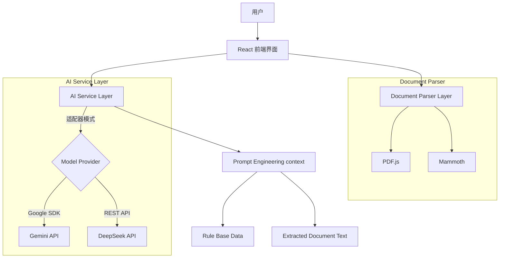

# 智能审查助手 (Smart Review Assistant) 项目文档

**版本:** 1.0.0  
**日期:** 2024-05-22  
**作者:** Senior Frontend Engineer

---

# 第一部分：软件需求规格说明书 (SRS)

## 1. 引言

### 1.1 编写目的
本文档旨在明确“智能审查助手”系统的功能需求、非功能需求及用户交互流程，为开发团队、测试团队及项目干系人提供统一的沟通基准和验收标准。

### 1.2 项目背景
在企业业务流程中，合同审查、标书分析及合规性检查通常耗费大量人力。本系统旨在利用大语言模型（LLM）技术，结合本地化的业务规则库，实现自动化的文档分析、风险提取及审查意见生成，从而提高审查效率和准确性。

### 1.3 适用范围
本系统适用于企业法务、财务、合规部门及项目经理，用于对PDF、Word或文本格式的业务文档进行预审查。

## 2. 用户角色

| 角色 | 描述 | 主要职责 |
| :--- | :--- | :--- |
| **审查员** | 系统主要使用者 | 维护规则库、上传审查材料、查看AI分析结果、导出审查意见。 |

## 3. 功能需求

### 3.1 规则知识库管理 (Rule Knowledge Base)
系统应允许用户管理用于审查的本地规则。

*   **FR-01 新增规则**：用户可手动输入规则标题、内容，并选择分类（法律、财务、合规、技术）。
*   **FR-02 导入规则**：支持通过上传文件（.pdf, .docx, .txt）自动解析并填入规则内容。
*   **FR-03 规则状态管理**：支持启用/停用特定规则，仅“已启用”的规则参与AI审查。
*   **FR-04 规则维护**：支持查看详情及删除规则。

### 3.2 审查工作台 (Review Workspace)
系统核心功能区，用于处理具体的审查任务。

*   **FR-05 文档上传**：支持上传 .pdf, .docx, .txt 文件。
*   **FR-06 文档解析**：
    *   对于文本和Word文件，提取纯文本。
    *   对于PDF文件，需提取纯文本（用于DeepSeek模型）并保留Base64格式（用于Gemini多模态）。
*   **FR-07 文档管理**：支持重命名、删除已上传的文档，支持直接添加纯文本片段。

### 3.3 智能分析功能 (AI Analysis)
基于选定的大模型和规则库进行分析。

*   **FR-08 执行摘要生成**：
    *   自动生成所有文档的综合摘要。
    *   **提示词增强**：支持用户输入自定义提示词（如“关注付款条款”），AI需结合该提示词生成摘要。
*   **FR-09 关键信息与风险提取**：
    *   依据“已启用”的规则，从文档中提取关键数据点。
    *   识别合规风险，并判定风险等级（高/中/低）。
    *   输出必须为结构化数据（JSON格式）。
*   **FR-10 审查意见拟定**：
    *   基于提取的风险点和规则，自动撰写正式的审查意见书。
    *   包含审查结论、合规分析及整改建议。

### 3.4 系统配置
*   **FR-11 模型切换**：支持在 Google Gemini (3.0 Pro/Flash) 和 DeepSeek (V3) 之间实时切换。
*   **FR-12 多语言支持**：支持界面及AI输出内容的中文/英文切换。

## 4. 非功能需求

*   **NFR-01 响应性**：UI需适配桌面端不同分辨率，支持侧边栏折叠或响应式布局。
*   **NFR-02 兼容性**：支持现代浏览器（Chrome, Edge, Safari）。
*   **NFR-03 隐私性**：API Key 仅在客户端存储（环境变量），不通过中间服务器转发。
*   **NFR-04 健壮性**：当PDF解析失败或AI接口超时，需给出明确的用户提示，而非页面崩溃。

---

# 第二部分：软件设计说明书 (SDS)

## 1. 系统架构设计

### 1.1 技术栈
*   **前端框架**: React 19 + TypeScript
*   **构建工具**: Vite
*   **样式库**: Tailwind CSS
*   **文档处理**:
    *   `mammoth`: .docx 转文本
    *   `pdfjs-dist`: .pdf 转文本
*   **AI SDK**:
    *   `@google/genai`: Gemini API 交互
    *   `fetch API`: DeepSeek (OpenAI-compatible) API 交互

### 1.2 架构图
本系统采用单页应用 (SPA) 架构，纯客户端运行，直接与大模型API通信。



## 2. 模块设计

### 2.1 目录结构
```text
src/
├── App.tsx             # 根组件，负责全局状态（路由、语言、模型选择）
├── types.ts            # 类型定义（领域模型）
├── services/
│   └── geminiService.ts # 核心AI服务层（含Prompt构建与API调用）
├── components/
│   ├── RuleBase.tsx    # 规则库管理模块
│   ├── ReviewPanel.tsx # 审查工作台模块
│   └── Icons.tsx       # 图标组件库
└── main.tsx            # 入口文件
```

### 2.2 数据模型设计 (TypeScript Interfaces)

#### 2.2.1 规则 (Rule)
```typescript
interface Rule {
  id: string;
  title: string;
  content: string; // 规则正文
  category: 'Legal' | 'Financial' | 'Compliance' | 'Technical';
  active: boolean; // 是否参与审查
}
```

#### 2.2.2 审查文档 (ReviewDocument)
为了兼容不同模型对输入要求的差异，采用双重存储策略。
```typescript
interface ReviewDocument {
  id: string;
  name: string;
  content: string;       // 纯文本 或 Base64 (PDF)
  extractedText?: string;// 专门为不支持多模态的模型提取的纯文本
  type: 'pdf' | 'docx' | 'txt';
  mimeType: string;
}
```

### 2.3 核心流程设计

#### 2.3.1 文档上传与解析流程
1.  用户选择文件。
2.  判断文件类型：
    *   **DOCX**: 使用 `mammoth.extractRawText` 转换为纯文本。
    *   **PDF**:
        *   生成 Base64 字符串（供 Gemini 多模态使用）。
        *   **同时** 使用 `pdfjs-dist` 逐页提取文本内容（供 DeepSeek 等纯文本模型使用）。
    *   **TXT**: FileReader 读取文本。
3.  存入 `ReviewDocument` 状态数组。

#### 2.3.2 AI 智能分析流程 (适配器模式)
`services/geminiService.ts` 封装了统一的调用接口，内部屏蔽模型差异。

**输入**: 文档列表, 激活的规则列表, 用户指令。

**处理逻辑**:
1.  **Prompt 构建**:
    *   拼接系统指令（System Instruction）。
    *   格式化规则列表文本。
    *   拼接文档内容（Gemini 使用 `inlineData` 传输 PDF，DeepSeek 使用 `extractedText`）。
2.  **模型路由**:
    *   `if (provider === 'Gemini')`: 调用 `ai.models.generateContent`。
    *   `else`: 调用 `fetch('https://api.deepseek.com/...')`。
3.  **结果处理**:
    *   摘要/意见：直接返回文本。
    *   信息提取：清洗 Markdown 标记，解析 JSON 字符串为对象数组。

## 3. 界面设计规范

### 3.1 布局
*   **侧边栏 (Sidebar)**: 深色背景 (`bg-slate-900`)，包含导航、模型选择器、语言切换。
*   **主内容区**: 浅色背景 (`bg-slate-50`)，卡片式设计。

### 3.2 交互反馈
*   **加载状态**: 所有异步操作（上传、AI生成）必须显示 Loading Spinner 或骨架屏。
*   **全屏模式**: 摘要、提取表格、意见区均支持全屏查看，便于阅读长文本。
*   **风险可视化**: 使用颜色标记风险等级（高风险-红色，中风险-橙色，低风险-绿色）。

## 4. 接口设计 (External Interfaces)

### 4.1 Gemini API
*   **Endpoint**: Google GenAI SDK 内部处理
*   **Model**: `gemini-3-flash-preview` (速度快，用于摘要/提取), `gemini-3-pro-preview` (推理强，用于拟定意见)
*   **Auth**: API Key via `process.env.API_KEY`

### 4.2 DeepSeek API
*   **Endpoint**: `https://api.deepseek.com/chat/completions`
*   **Method**: POST
*   **Model**: `deepseek-chat` (V3)
*   **Auth**: Bearer Token via `process.env.DEEPSEEK_API_KEY`
*   **Body**: 标准 OpenAI Chat Completion 格式

---
**文档结束**
